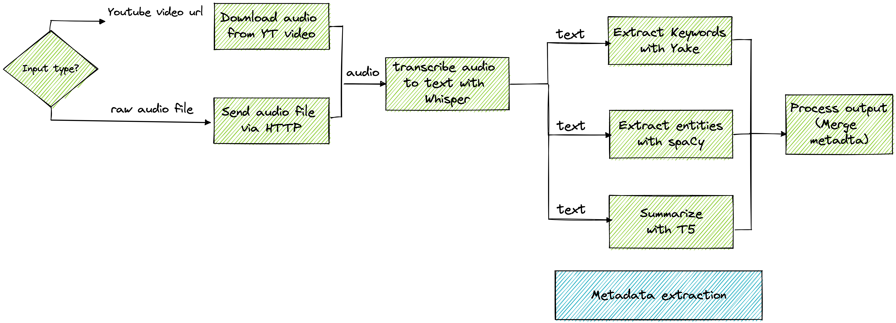
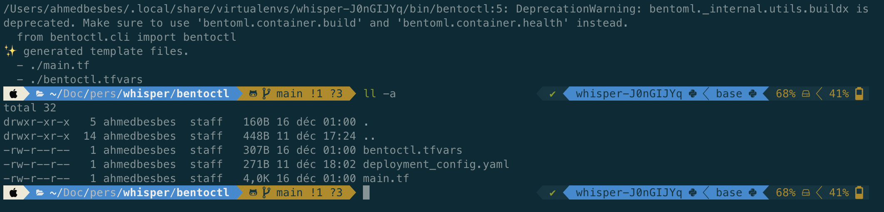
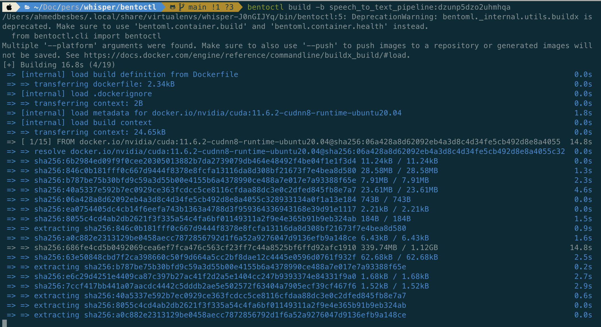
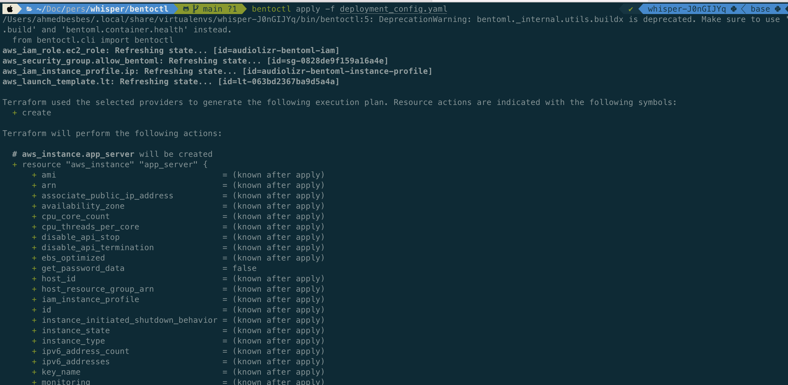
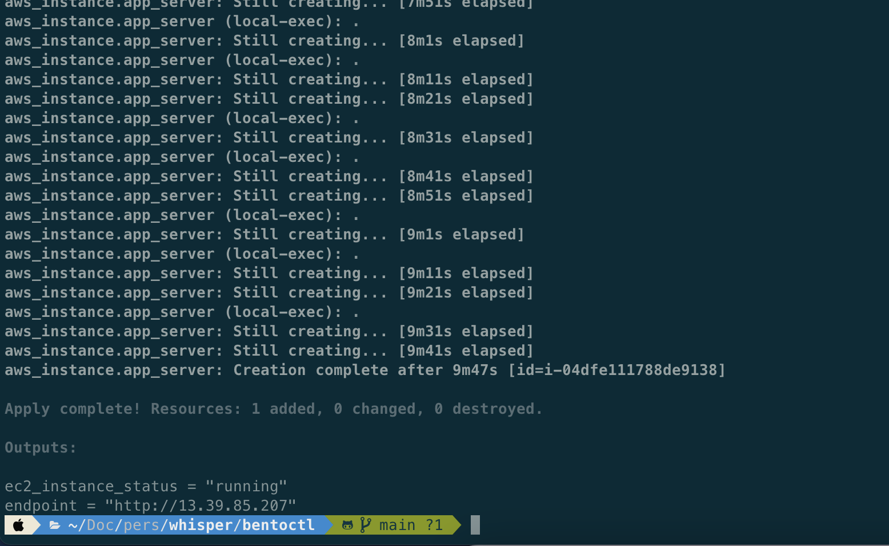
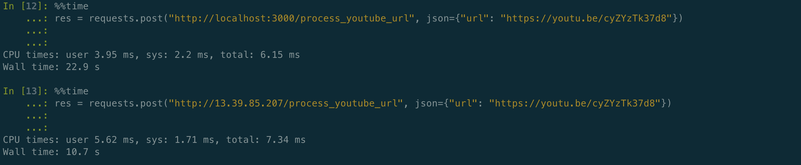
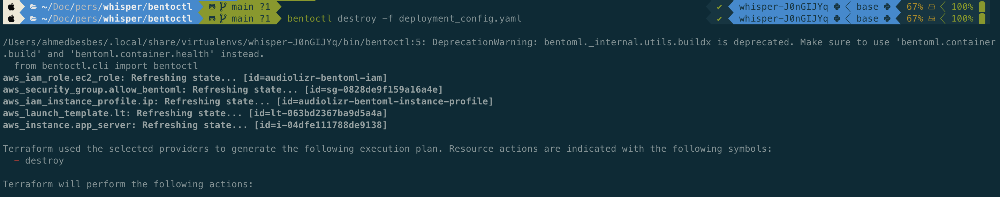
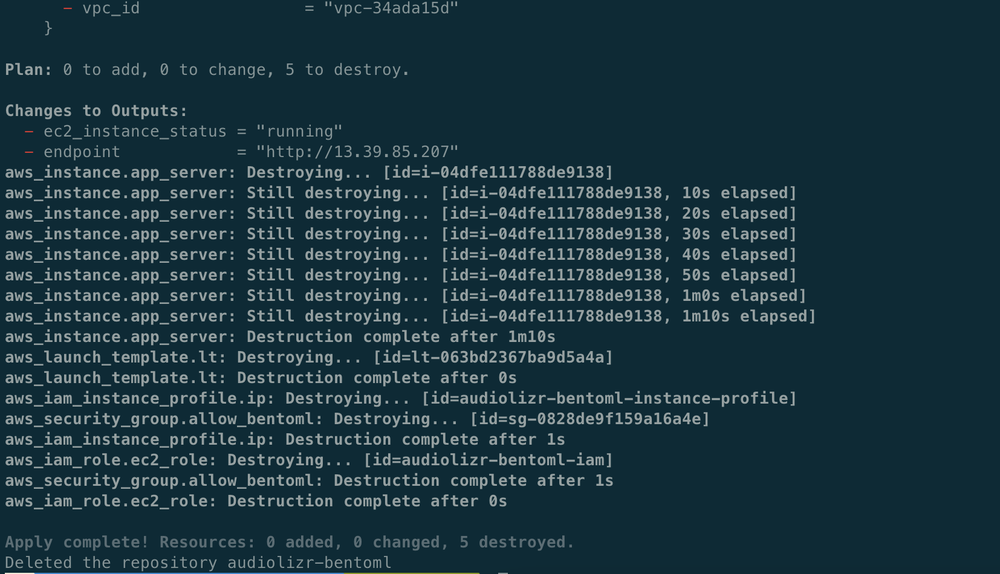

# audiolizr

Audiolizr (***audio*** and ***analyzer***) is an API built and deployed with BentoML to transcribe Youtube videos and extract the following metadata: 

- keywords and topics using the Yake algorithm
- a generated summary using the T5 Transformer model
- named entities (people's name, locations, products, organizations, etc.) using spaCy

This API can be used to provide a summary and additional information to understand any youtube video or audio content.  

This service is deployed on AWS EC2 on a GPU-powered [g4dn.xlarge](https://aws.amazon.com/fr/ec2/instance-types/g4/) instance. (see deployment section for details)





### Demo

I've used audiolizr to process this (interesting) TEDx short video

[](https://www.youtube.com/watch?v=cyZYzTk37d8)

Here a demo of audiolizr in Streamlit:

<video>
  <source src="./images/demo.mp4" type="video/mp4">
</video>


As shown in the following diagram, the video moves through different runners to

1. download the audio
2. transcribe the audio into text
3. extract keywords
4. extract named entities
5. summarize the text

note: runners 1 and 2 are executed sequentially and runners 3, 4 and 5 are executed concurrently


Here's the JSON output that you'd get at the end of the pipeline:

```json
{
  "transcript": "How much do you get paid? Don't answer that out loud. But put a number in your head. Now, how much do you think the person sitting next to you gets paid? It turns out that pay transparency, sharing salaries openly across a company, makes for a better workplace for both the employee and for the organization. You see, keeping salary secret leads to what economists call information asymmetry. This is a situation where in a negotiation, one party has loads more information than the other. And in hiring or promotion or annual raise discussions, an employer can use that secrecy to save a lot of money. Imagine how much better you could negotiate for a raise if you knew everybody's salary. Now, I realized that letting people know what you make might feel uncomfortable, but isn't it less uncomfortable than always wondering if you're being discriminated against, or if your wife or your daughter or your sister is being paid unfairly? Openness remains the best way to ensure fairness. And pay transparency does that.",
  "metadata": {
    "keywords": [
      [
        "pay transparency",
        0.19212871128874295
      ],
      [
        "information",
        0.27056834789491807
      ],
      [
        "salary",
        0.27854871121244107
      ],
      [
        "raise",
        0.2849695469393418
      ],
      [
        "uncomfortable",
        0.2997431150212997
      ],
      [
        "paid unfairly",
        0.3407466612452491
      ],
      [
        "information asymmetry",
        0.4356297000199267
      ],
      [
        "call information asymmetry",
        0.4715329551423117
      ],
      [
        "sharing salaries openly",
        0.47429797071055785
      ],
      [
        "call information",
        0.49492941874515994
      ]
    ],
    "entities": [
      {
        "entity_text": "one",
        "entity_label": "CARDINAL",
        "start": 438,
        "end": 441
      },
      {
        "entity_text": "annual",
        "entity_label": "DATE",
        "start": 521,
        "end": 527
      }
    ],
    "summary": "If you know everybody's salary, you can save a lot of money. And in hiring or promotion or annual raise discussions, an employer can use that secrecy to save money. Pay transparency, sharing salaries openly across companies, makes for better workplaces for both the employee and for the organization. I realized that letting people know what you make might feel uncomfortable, but isn't it less uncomfortable than always wondering whether your wife or your daughter is being paid unfairly?"
  }
}
```
### Dependencies

- [pytube](https://github.com/pytube/pytube) 
- [whisper](https://github.com/openai/whisper) (from OpenAI)
- [Yake](https://github.com/LIAAD/yake) 
- [spaCy](https://github.com/explosion/spaCy)
- [transformers](https://github.com/huggingface/transformers)

### Run locally

Run the following commands to start a fresh environment with the needed dependencies:

```
cd audiolizr/
pipenv install 
pipenv shell

# install whisper with pip
pip install git+https://github.com/openai/whisper.git
# install spacy language model
python -m spacy download en_core_web_md 
```

To serve the API locally, run the following command. 

```
cd src/
bentoml serve service:svc --reload
```

To serve the API in production mode (and enable multiple api workers), run the following command (keep `--api-workers` low to avoid hammering the RAM)

```
cd src/
bentoml serve service:svc --production --api-workers 2
```

If everything works as expected, build the bento to prepare the deployment:

```
cd src/
bentoml build
```

Here's what you'll see when it's done:

```
[nltk_data] Downloading package punkt to
[nltk_data]     /Users/ahmedbesbes/nltk_data...
[nltk_data]   Package punkt is already up-to-date!
Building BentoML service "speech_to_text_pipeline:m57a6etzlg4imhqa" from build context "/Users/ahmedbesbes/Documents/perso/whisper/src".

██████╗░███████╗███╗░░██╗████████╗░█████╗░███╗░░░███╗██╗░░░░░
██╔══██╗██╔════╝████╗░██║╚══██╔══╝██╔══██╗████╗░████║██║░░░░░
██████╦╝█████╗░░██╔██╗██║░░░██║░░░██║░░██║██╔████╔██║██║░░░░░
██╔══██╗██╔══╝░░██║╚████║░░░██║░░░██║░░██║██║╚██╔╝██║██║░░░░░
██████╦╝███████╗██║░╚███║░░░██║░░░╚█████╔╝██║░╚═╝░██║███████╗
╚═════╝░╚══════╝╚═╝░░╚══╝░░░╚═╝░░░░╚════╝░╚═╝░░░░░╚═╝╚══════╝

Successfully built Bento(tag="speech_to_text_pipeline:m57a6etzlg4imhqa").
```

When a bento is created, build a Docker image from it with this command:

```shell
bentoml containerize speech_to_text_pipeline:m57a6etzlg4imhqa
```

This will run multiple steps to build the docker image:

```shell
Building OCI-compliant image for speech_to_text_pipeline:m57a6etzlg4imhqa with docker

[+] Building 30.7s (20/20) FINISHED
 => [internal] load build definition from Dockerfile                                                                                                                         0.0s
 => => transferring dockerfile: 2.52kB                                                                                                                                       0.0s
 => [internal] load .dockerignore                                                                                                                                            0.0s
 => => transferring context: 2B                                                                                                                                              0.0s
 => [internal] load metadata for docker.io/nvidia/cuda:11.6.2-cudnn8-runtime-ubuntu20.04                                                                                     1.1s
 => [base-container  1/15] FROM docker.io/nvidia/cuda:11.6.2-cudnn8-runtime-ubuntu20.04@sha256:812fe80b7123467f5d6c746bd5d7cbd3b96f385c3c6a57a532b21617ad433858              0.0s
 => [internal] load build context                                                                                                                                            0.0s
 => => transferring context: 24.82kB                                                                                                                                         0.0s
 => CACHED [base-container  2/15] RUN rm -f /etc/apt/apt.conf.d/docker-clean; echo 'Binary::apt::APT::Keep-Downloaded-Packages "true";' > /etc/apt/apt.conf.d/keep-cache     0.0s
 => CACHED [base-container  3/15] RUN --mount=type=cache,target=/var/lib/apt --mount=type=cache,target=/var/cache/apt set -eux &&     apt-get update -y &&     apt-get inst  0.0s
 => CACHED [base-container  4/15] RUN --mount=type=cache,target=/var/lib/apt --mount=type=cache,target=/var/cache/apt     set -eux &&     apt-get install -y --no-install-r  0.0s
 => CACHED [base-container  5/15] RUN ln -sf /usr/bin/python3.9 /usr/bin/python3 &&     ln -sf /usr/bin/pip3.9 /usr/bin/pip3                                                 0.0s
 => CACHED [base-container  6/15] RUN curl -O https://bootstrap.pypa.io/get-pip.py &&     python3 get-pip.py &&     rm -rf get-pip.py                                        0.0s
 => CACHED [base-container  7/15] RUN groupadd -g 1034 -o bentoml && useradd -m -u 1034 -g 1034 -o -r bentoml                                                                0.0s
 => CACHED [base-container  8/15] RUN mkdir /home/bentoml/bento && chown bentoml:bentoml /home/bentoml/bento -R                                                              0.0s
 => CACHED [base-container  9/15] WORKDIR /home/bentoml/bento                                                                                                                0.0s
 => [base-container 10/15] COPY --chown=bentoml:bentoml . ./                                                                                                                 0.0s
 => [base-container 11/15] RUN --mount=type=cache,target=/root/.cache/pip bash -euxo pipefail /home/bentoml/bento/env/python/install.sh                                     20.6s
 => [base-container 12/15] RUN chmod +x /home/bentoml/bento/env/docker/setup_script                                                                                          0.2s
 => [base-container 13/15] RUN /home/bentoml/bento/env/docker/setup_script                                                                                                   6.1s
 => [base-container 14/15] RUN rm -rf /var/lib/{apt,cache,log}                                                                                                               0.2s
 => [base-container 15/15] RUN chmod +x /home/bentoml/bento/env/docker/entrypoint.sh                                                                                         0.2s
 => exporting to image                                                                                                                                                       2.2s
 => => exporting layers                                                                                                                                                      2.2s
 => => writing image sha256:a08cdb9a3818379359500fe78c0af72a38516cde471e8f6ca1c26e177a7f99c1                                                                                 0.0s
 => => naming to docker.io/library/speech_to_text_pipeline:m57a6etzlg4imhqa                                                                                                  0.0s
Successfully built Bento container for "speech_to_text_pipeline" with tag(s) "speech_to_text_pipeline:m57a6etzlg4imhqa"
To run your newly built Bento container, use 'speech_to_text_pipeline:m57a6etzlg4imhqa' as a tag and pass it to 'docker run'. For example:
    docker run -it --rm -p 3000:3000 speech_to_text_pipeline:m57a6etzlg4imhqa serve --production
```

Run the API from the Docker image (with port forward) and check that everything's running fine from the host

```
docker run -it --rm -p 3000:3000 speech_to_text_pipeline:m57a6etzlg4imhqa serve --production --api-workers 2
```

Head over http://localhost:3000 to try out the API

### Deploy to EC2

To deploy the API on AWS, you need to follow these steps:

**1. Install the required tools**

- Install the AWS CLI and configure an AWS account (see AMI) with granted permissions to Cloudformation, Lambda, API Gateway and ECR. Here's the installation [guide](https://docs.aws.amazon.com/cli/latest/userguide/getting-started-install.html)
- install bentoctl : `pip install bentoctl` (already installed in the pipenv environment)
- install Terraform. This is a tool for building, configuring and managing infrastructure with code: follow these [instructions](https://developer.hashicorp.com/terraform/downloads?product_intent=terraform) depending on your OS


**2. Setup the deployment config**

To deploy the BentoML service on AWS, we will use bentoctl, a tool that helps deploy any machine learning model on any cloud infrastructure. 

bentoctl uses Terraform under the hood. 

Since we're going to deploy the service on EC2, we first need to install the AWS EC2 operator to generate and apply the Terraform files

```shell
bentoctl operator install aws-ec2
```

The deployment configuration must be detailed in a `deployment_config.yaml` file (this one is contained in the `bentoctl` folder)

This file contains details about the instance type, the AMI ID, the region, etc.

```yaml
api_version: v1
name: audiolizr-bentoml
operator:
  name: aws-ec2
template: terraform
spec:
  region: eu-west-3
  instance_type: g4dn.xlarge
  # points to Deep Learning AMI GPU PyTorch 1.12.0 (Ubuntu 20.04) 20220913 AMI
  ami_id: ami-0aed2a32a2ea85e67
  enable_gpus: true
```


**3. Generate the Terraform files**

Simply run

```shell
bentoctl generate -f deployment_config.yaml
```

This will generates the main.tf and bentoctl.tfvars




**4. Build the Docker image and push it to ECR**

The image upload may take time depending on your bandwith

```shell
bentoctl build -b speech_to_text_pipeline:dzunp5dzo2uhmhqa
```


**5. Apply the Terraform file to deploy to AWS EC2**

In this step, we apply the Terraform file to deploy the docker image on an EC2.

This step fires up an instance and configures all the needed installation



When everything is up and running (~ takes approximatively 10 minutes), you will be prompted with a your API URL. 

 

🎉 !


**6. Test the API**

Once the API is deployed, you can try it out either from the browser or via a python client.

Let's query it from an ipython terminal and compare the inference time with my locally running smae API (with no GPU)

By upload an audo file 

- local: 15.9s
- aws: 4.57s **(+3 times faster)**

 


By downloading a youtube video

- local: 22.9s
- aws: 10.7s (**~2 times faster**)

 

7. Remove the service when you don't need it anymore

```shell
bentoctl destroy -f deployment_config.yaml
```

 
 

